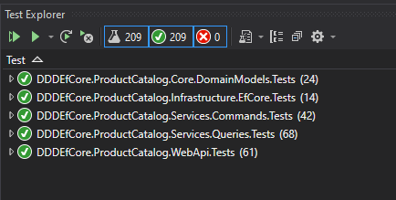
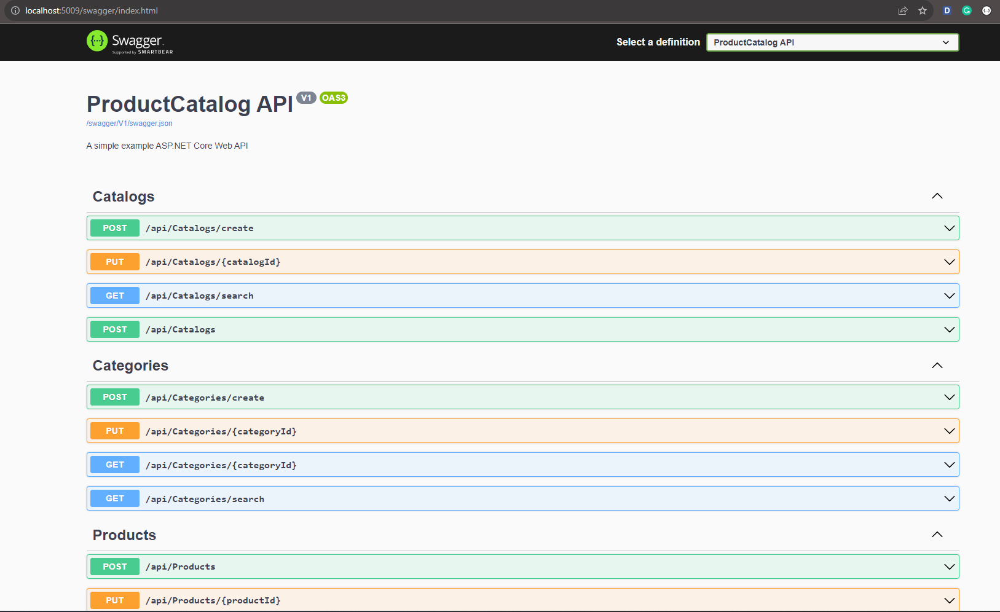

# An Example of using DDD with .NET Core 3.1

[](https://kimcu.visualstudio.com/ddd-net-ef-core/_build/latest?definitionId=8&branchName=master)

- Domain Driven Design (aka DDD)
- .NET Core 3.1
- EntityFramework Core 3.1

## Overview

### Domain Models

In the **Product Catalog** bounded context, I have a following Aggregate-Roots, Entities and Value Objects

1. Aggregate-Roots:
   1. Product
   2. Category
   3. Catalog

2. Entities:
   1. CatalogCategory
   2. CatalogProduct

3. Value Objects:
   1. CategoryId
   2. ProductId
   3. CatalogId
   4. CatalogCategoryId
   5. CatalogProductId

### Aggregate Root Relationships

1. `Catalog` and `Category`
    - The `CatalogCategory` represents the instance of `Category` in specific `Catalog`

2. `Category` and `Category`
    - In specific `Catalog`, the categories can be organized as tree structure. Therefore, the `CatalogCategory` can have another as its parent.

3. `Product`, `Category` and `Catalog`
    - The `CatalogProduct` represents the instance of `Product` in specific `CatalogCategory`

### [CQRS](https://martinfowler.com/bliki/CQRS.html)

1. `DDDEfCore.ProductCatalog.Services.Commands`: for Create, Update and delete operators by consuming repositories.
2. `DDDEfCore.ProductCatalog.Services.Queries`: for all of the query operators by using [Dapper](https://github.com/StackExchange/Dapper)

## Highlighted Points

### Strongly-Typed Entities Id

I want to use Strongly-Typed Ids for all models (i.e. `CatalogId`, `CatalogCategoryId` and so on) because of the benefits that described very well in the series of **Using strongly-typed entity IDs to avoid primitive obsession** [part 1](https://andrewlock.net/using-strongly-typed-entity-ids-to-avoid-primitive-obsession-part-1/), [part-2](https://andrewlock.net/using-strongly-typed-entity-ids-to-avoid-primitive-obsession-part-2/), [part-3](https://andrewlock.net/using-strongly-typed-entity-ids-to-avoid-primitive-obsession-part-3/). Therefore, I have to add some advance steps to accomplish this need

1. For EntityFramework Core

- Use [Value Conversion](https://docs.microsoft.com/en-us/ef/core/modeling/value-conversions) feature to define the mapping.

    ```csharp
            builder
                .Property(x => x.Id)
                .UsePropertyAccessMode(PropertyAccessMode.Field)
                .HasConversion(x => x.Id, id => (CatalogId)id);
    ```

2. For Dapper

- Custom `SqlMapper.TypeHandler`

    ```csharp
        public class StronglyTypedIdMapper<TIdenity> : SqlMapper.TypeHandler<TIdenity> where TIdenity : IdentityBase
        {
            #region Overrides of TypeHandler<TIdenityType>

            public override void SetValue(IDbDataParameter parameter, TIdenity value)
            {
                parameter.Value = value.Id;
            }

            public override TIdenity Parse(object value)
            {
                return IdentityFactory.Create<TIdenity>(value);
            }

            #endregion
        }
    ```

3. For .NET Core

- Custom `TypeConverter`

    ```csharp
        public class StronglyTypedIdConverter<TIdentity> : TypeConverter where TIdentity : IdentityBase
        {
            #region Overrides of TypeConverter

            public override bool CanConvertFrom(ITypeDescriptorContext context, Type sourceType)
            {
                return sourceType == typeof(string) || base.CanConvertFrom(context, sourceType);
            }

            public override object ConvertFrom(ITypeDescriptorContext context, CultureInfo culture, object value)
            {
                var stringValue = value as string;
                if (!string.IsNullOrEmpty(stringValue) && Guid.TryParse(stringValue, out var guid))
                {
                    return IdentityFactory.Create<TIdentity>(guid);
                }

                return base.ConvertFrom(context, culture, value);
            }

            #endregion
        }
    ```

- Custom `JsonConverter`

    ```csharp
        public class IdentityJsonConverter<TIdentity> : JsonConverter<TIdentity> where TIdentity : IdentityBase
        {
            public override bool CanConvert(Type typeToConvert)
            {
                return typeToConvert == typeof(TIdentity);
            }

            public override TIdentity Read(ref Utf8JsonReader reader, Type typeToConvert, JsonSerializerOptions options)
            {
                return IdentityFactory.Create<TIdentity>(reader.GetGuid());
            }

            public override void Write(Utf8JsonWriter writer, TIdentity value, JsonSerializerOptions options)
            {
                writer.WriteStringValue(value.Id);
            }
        }
    ```

### For CQRS

- Use [MediatR](https://github.com/jbogard/MediatR) for commands/queries dispatcher
- Use [FluentValidation](https://fluentvalidation.net/) for commands/queries validation

### For Testing

#### About Test Projects

1. `DDDEfCore.ProductCatalog.Core.DomainModels.Tests`
    - Unit Test for the behaviors of Domain Models

2. `DDDEfCore.ProductCatalog.Infrastructure.EfCore.Tests`
    - Integration Test with EntityFramework Core and SqlServer for repositories of Aggregate-Roots

3. `DDDEfCore.ProductCatalog.Services.Commands.Tests`
    - Unit Test of Command Handlers.
    - Use [Moq.EntityFrameworkCore](https://github.com/MichalJankowskii/Moq.EntityFrameworkCore) to mock `DbSet`.

4. `DDDEfCore.ProductCatalog.Services.Queries.Tests`
    - Integration Test with [Dapper](https://github.com/StackExchange/Dapper) and SqlServer for Query Handlers.

5. `DDDEfCore.ProductCatalog.WebApi.Tests`
   - Integration Test with Web Api by consuming `Microsoft.AspNetCore.TestHost`

#### Interesting Points

For every test project, I use the following packages

- [Shoudly](https://github.com/shouldly/shouldly): Should testing for .NET - the way Asserting *Should* be! 
- [AutoFixture](https://github.com/AutoFixture/AutoFixture): AutoFixture is an open source library for .NET designed to minimize the 'Arrange' phase of your unit tests in order to maximize maintainability. Its primary goal is to allow developers to focus on what is being tested rather than how to setup the test scenario, by making it easier to create object graphs containing test data.
- [Respawn](https://github.com/jbogard/Respawn): Intelligent database cleaner for integration tests


## How to run

### Run Test Projects

- In every integration test project, there are `appsettings.json` files that store `connectstrings` value. You have to change these values before running.



### Run via swagger from Visual Studio

- You have to change the `connectionstring` value in `appsettings.Development.json` under `DDDEfCore.ProductCatalog.WebApi`
- After run the WebApi by `Ctrl+F5` from Visual Studio, assume the Url is `http://localhost:[port]`
	- Switch to swagger via `swagger`

	

## How to see the codecoverage report

- Use PowerShell, change location to `cake`; then execute the following command

```powershell
.\build.ps1
```

- After run successfully, go to `code_coverage` folder, and open the `index.html` by browser to see the report

## Give a Star! :star:

If you liked this project or if it helped you, please give a star :star: for this repository. Thank you!!!
