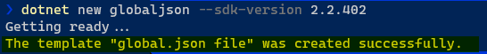

# Upgrade version of dotnet core

## Assumptions

- The projects are currently developed with dotnet core `2.2.xxx`. In which, we don't know exactly what "xxx" is.
- The `global.json` has not been created yet.

## Requirements

- We need to upgrade to the newest version of dotnet core which is `3.0.100` atm (Nov-2019)

## Getting Started

### Add "Global.json"

- Since, we don't have `global.json` file at the moment. Therefore, let's create it with assumption that the version of dotnet core is `2.2.402`

```cmd
dotnet new globaljson --sdk-version 2.2.402
```

- Here is the result



- To make sure it works correctly, we should rebuild and also rerun our unittest (if any).
- Resource: [global.json overview](https://docs.microsoft.com/en-us/dotnet/core/tools/global-json)

### Let's upgrade SDK to dotnet core 3.0.100

- Opening `Global.json` change `2.2.402` to `3.0.100`.
- Follow the guide [Migrate from ASP.NET Core 2.2 to 3.0](https://docs.microsoft.com/en-us/aspnet/core/migration/22-to-30?view=aspnetcore-3.0&tabs=visual-studio)
- After that, open the nuget in order to upgrade all the packages that depend on dotnet core
  - EntityFrameworkCore
  - FluentValidator
  - ....